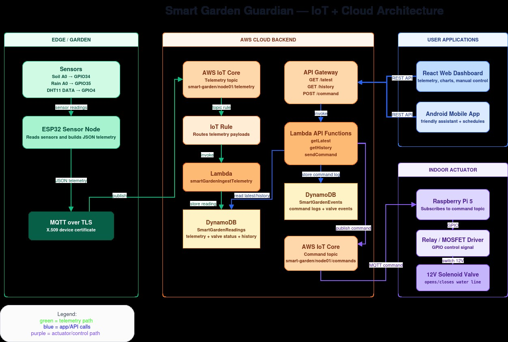
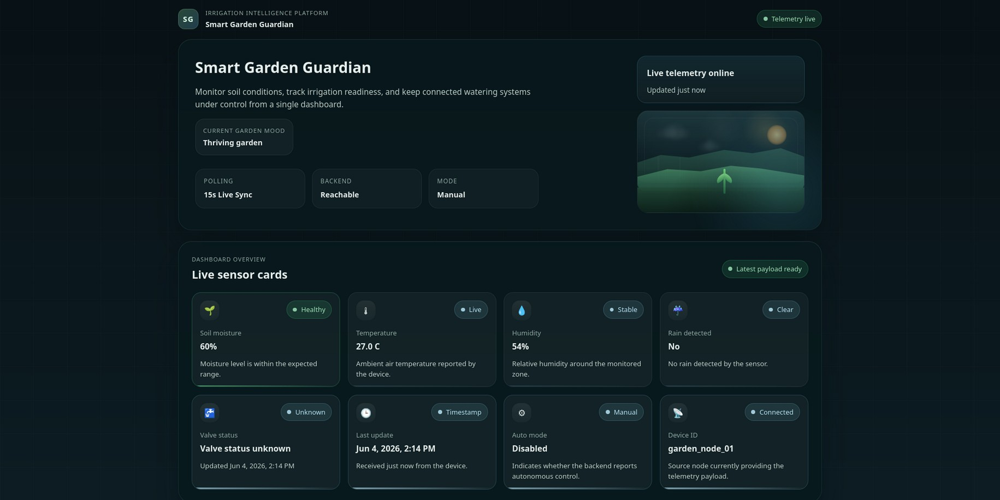
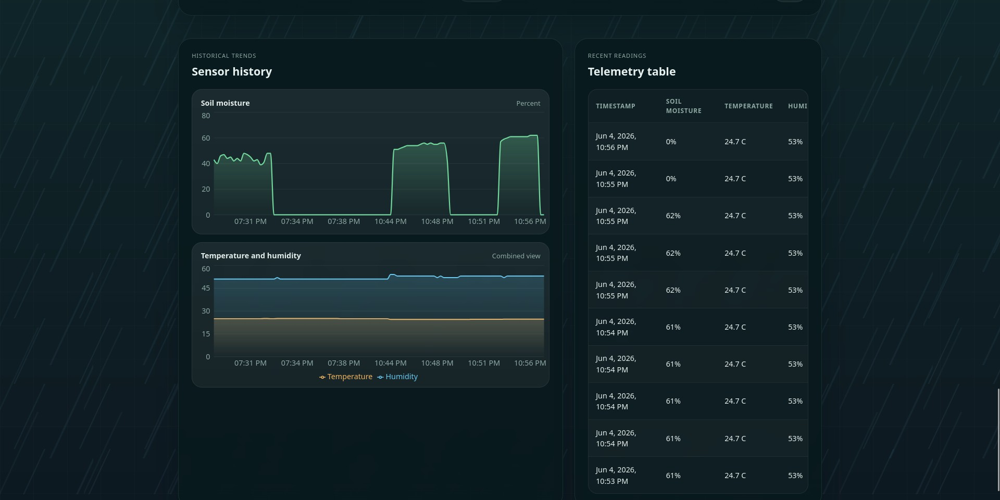
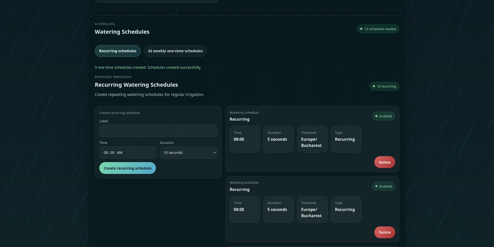
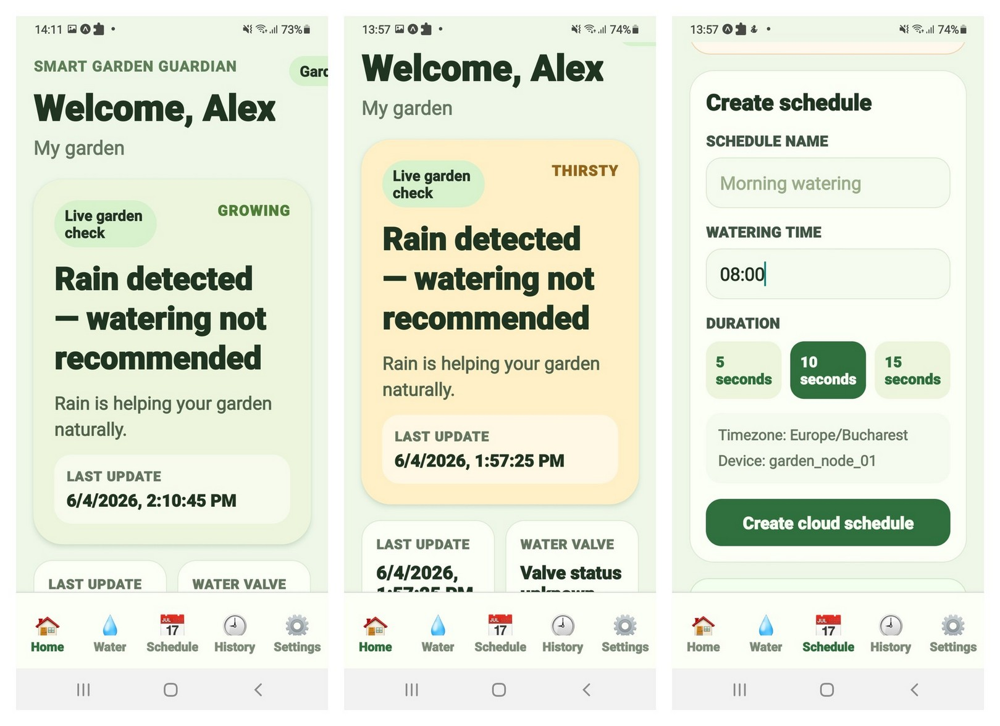
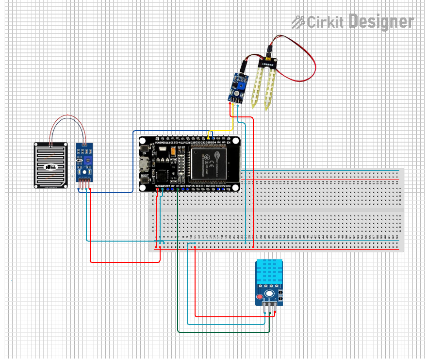
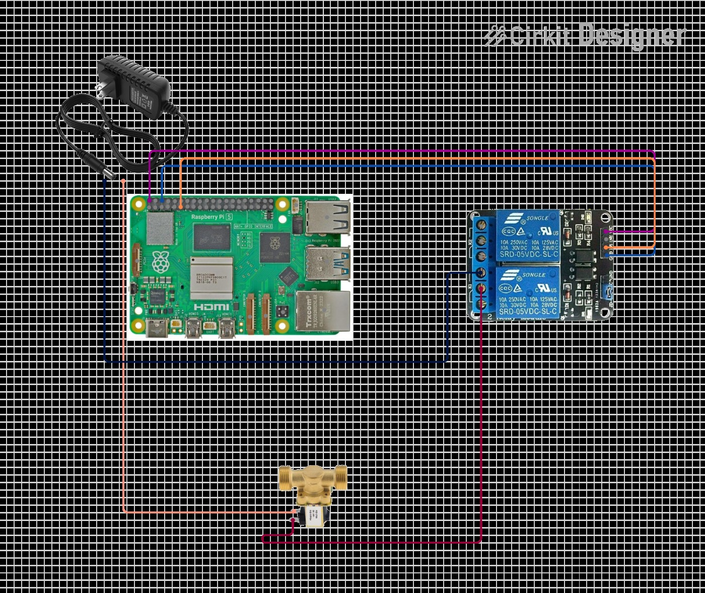

# Smart Garden Guardian

Smart Garden Guardian is an end-to-end IoT irrigation platform built around a real family garden use case. It combines embedded sensing, secure cloud messaging, serverless backend services, a React web dashboard, and an Android mobile app to monitor garden conditions and trigger watering remotely.

This project is strong portfolio material because it is not just a UI or just firmware work. It connects hardware, cloud infrastructure, data pipelines, and user-facing applications into one working system.



## Project Highlights

- Built a complete IoT system with an ESP32 sensor node, Raspberry Pi 5 actuator controller, AWS backend, React web app, and Expo/React Native mobile app.
- Implemented secure MQTT over TLS with X.509 certificates for device-to-cloud communication through AWS IoT Core.
- Designed a serverless backend with Lambda, API Gateway, DynamoDB, IoT Rules, and EventBridge Scheduler.
- Added remote valve control, telemetry history, recurring watering schedules, and AI-assisted weekly watering recommendations.
- Kept the browser and mobile clients lightweight by moving weather lookup, schedule orchestration, and AI planning into backend services.

## What It Does

- Reads soil moisture, rain, temperature, and humidity from the garden.
- Publishes telemetry from the ESP32 to AWS IoT Core.
- Stores latest readings, historical readings, schedules, and valve events in DynamoDB.
- Lets users monitor garden status from a web dashboard or Android app.
- Sends manual watering commands to a Raspberry Pi that controls a 12V solenoid valve.
- Creates recurring schedules and one-time weekly schedules in EventBridge Scheduler.
- Generates an AI weekly watering plan from the latest telemetry plus Open-Meteo forecast data.

## System Architecture

The system is split into four layers:

1. `Edge sensing`: ESP32 reads sensors and publishes JSON telemetry.
2. `Cloud backend`: AWS IoT Core, IoT Rules, Lambda, API Gateway, DynamoDB, and EventBridge Scheduler handle ingestion, APIs, commands, and schedules.
3. `User applications`: React web and Android mobile clients read data and send actions through REST APIs.
4. `Actuation`: Raspberry Pi subscribes to watering commands and switches a relay-driven 12V solenoid valve.

### Data Flow

1. ESP32 publishes telemetry to `smart-garden/node01/telemetry`.
2. AWS IoT Core receives the message and an IoT Rule invokes `ingest-telemetry`.
3. Lambda stores readings in DynamoDB.
4. Web and mobile clients call API Gateway endpoints such as `/latest`, `/history`, `/command`, and `/schedules`.
5. Manual or scheduled watering commands are published to `smart-garden/node01/commands`.
6. Raspberry Pi executes the command and publishes valve status to `smart-garden/node01/status`.

## Demo Surfaces

### Web dashboard

The web app is the main monitoring and control interface. It shows live telemetry, valve status, history charts, recent readings, recurring schedules, and AI-generated weekly plans.







### Android mobile app

The Android app uses the same backend API and provides portable access to garden status, watering controls, history, and schedule management.



### Hardware prototype

The prototype separates sensing from actuation: the ESP32 handles telemetry near the sensors, while the Raspberry Pi controls the valve path indoors through a relay module.

#### ESP32 sensor node

The sensor node connects the ESP32 to the rain sensor, capacitive soil moisture sensor, and DHT11 module, then publishes telemetry to AWS IoT Core.



#### Raspberry Pi valve controller

The actuator subsystem uses a Raspberry Pi 5, relay module, and 12V solenoid valve to execute watering commands coming from the cloud.



## Technical Stack

| Layer | Technologies |
| --- | --- |
| Embedded sensing | ESP32, Arduino, DHT11, capacitive soil moisture sensor, rain sensor |
| Actuation | Raspberry Pi 5, Python, `awsiotsdk`, `gpiozero`, relay/MOSFET driver, 12V solenoid valve |
| Cloud | AWS IoT Core, AWS IoT Rules, AWS Lambda, Amazon API Gateway, Amazon DynamoDB, Amazon EventBridge Scheduler |
| Web | React, TypeScript, Vite, Recharts |
| Mobile | Expo, React Native, TypeScript |
| External APIs | Open-Meteo, Google Gemini |

## Notable Engineering Decisions

- `Secure device communication`: device traffic uses MQTT over TLS instead of exposing direct cloud credentials in the frontend.
- `Thin clients`: browser and mobile apps call REST endpoints only; AWS certificates, weather logic, and Gemini API usage stay in the backend.
- `Separated sensing and actuation`: telemetry collection and valve control run on different devices, which made the prototype easier to test and evolve.
- `AI schedules are one-time only`: generated recommendations become explicit one-time schedules for a selected week, which avoids leaving stale automation behind.

## Repository Structure

```text
smart-garden-guardian/
├── aws-lambda-functions/   # Serverless API, ingestion, scheduling, and AI plan handlers
├── esp32/                  # ESP32 sensor firmware
├── rpi/                    # Raspberry Pi valve controller
├── web/                    # React + Vite dashboard
├── app/                    # Expo / React Native Android app
├── docs/                   # Extracted screenshots and documentation assets
└── Smart_Garden_Guardian_Documentation.pdf
```

## API Surface

| Method | Endpoint | Purpose |
| --- | --- | --- |
| `GET` | `/latest` | Returns the latest telemetry and valve status |
| `GET` | `/history` | Returns recent telemetry history for charts and tables |
| `POST` | `/command` | Sends manual valve commands |
| `GET` | `/schedules` | Lists recurring and one-time schedules |
| `POST` | `/schedules` | Creates recurring or one-time schedules |
| `DELETE` | `/schedules/{schedule_id}` | Deletes a schedule |
| `POST` | `/ai/watering-plan` | Generates a weekly AI watering plan |

## Local Setup

### Web dashboard

```bash
cd web
npm install
cp .env.example .env
npm run dev
```

Required environment variables:

```env
VITE_API_BASE_URL=https://YOUR_API_GATEWAY_URL
VITE_APP_NAME=Smart Garden Guardian
VITE_DEVICE_ID=garden_node_01
```

### Android app

```bash
cd app
npm install
cp .env.example .env
npm run android
```

Required environment variables:

```env
EXPO_PUBLIC_API_BASE_URL=https://YOUR_API_GATEWAY_URL
EXPO_PUBLIC_APP_NAME=Smart Garden Guardian
EXPO_PUBLIC_DEVICE_ID=garden_node_01
EXPO_PUBLIC_USER_NAME=Garden Keeper
```

### Raspberry Pi controller

```bash
cd rpi
python3 -m venv .venv
source .venv/bin/activate
pip install -r requirements.txt
cp .env.example .env
```

Key configuration values:

```env
AWS_IOT_ENDPOINT=your-endpoint-ats.iot.us-east-1.amazonaws.com
AWS_IOT_COMMAND_TOPIC=smart-garden/node01/commands
AWS_IOT_STATUS_TOPIC=smart-garden/node01/status
DEVICE_ID=garden_node_01
RELAY_GPIO=17
MAX_WATERING_SECONDS=15
```

### ESP32 firmware

Create `esp32/secrets.h` from `esp32/secrets.example.h` and provide:

- Wi-Fi credentials
- AWS IoT endpoint
- Root CA
- Device certificate
- Device private key

## Resume-Oriented Summary

If you need a concise description for a CV or portfolio:

> Built an end-to-end smart irrigation platform using ESP32, Raspberry Pi, AWS IoT Core, Lambda, DynamoDB, API Gateway, EventBridge Scheduler, React, and React Native; implemented secure MQTT telemetry, remote valve control, historical analytics, cloud schedules, and AI-assisted weekly watering recommendations.

## Current Limitations

- Valve status reflects command execution, not confirmed physical water flow, because the prototype does not include a flow sensor.
- Soil moisture accuracy depends on calibration and sensor connection quality.
- Schedule listing is prototype-oriented and could be optimized further for larger deployments.
- Production hardening still needs authentication, authorization, and stricter public API controls.

## Future Improvements

- Add a water-flow sensor for physical confirmation.
- Improve per-installation soil calibration.
- Add notifications for dry soil, failed watering runs, or abnormal readings.
- Introduce authentication and role-based access control for the hosted clients.
